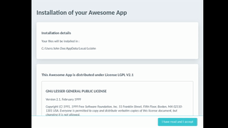

# Installer

Installer is a cross-platform wizzard installer who follows this pattern :
1. User reads conditions.
2. Installation is processed if user accepts.
3. Installation displays a success message if all went well.

This package should be used through its library available here :
https://github.com/audrenbdb/installer/lib/installer

## Demo 

